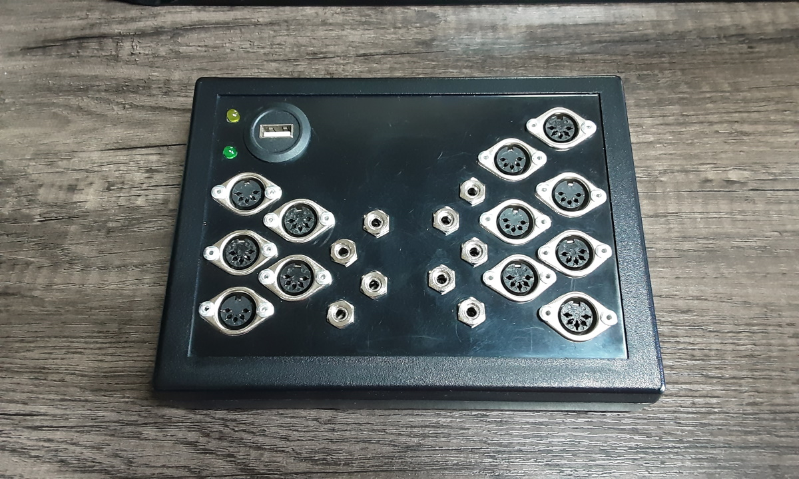
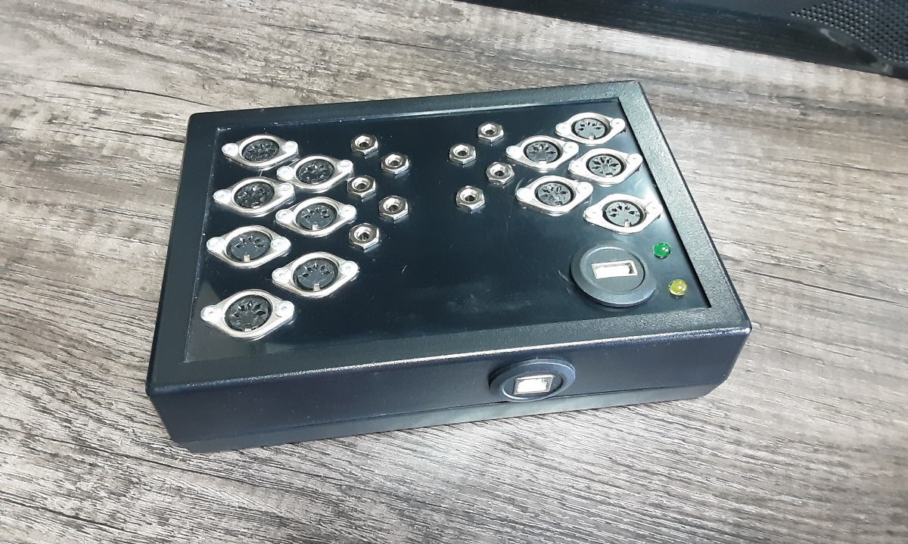
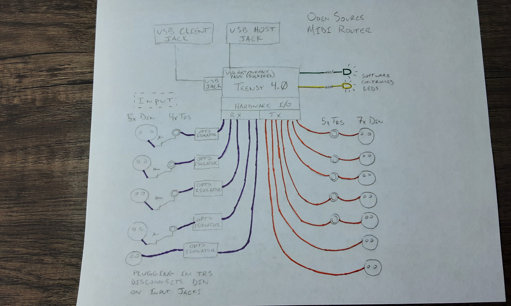
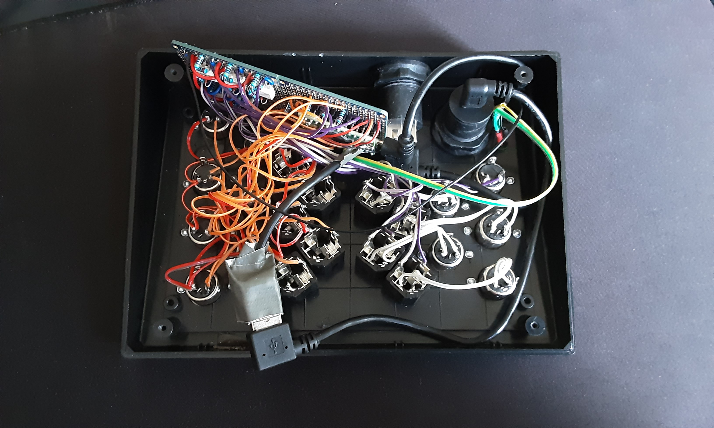
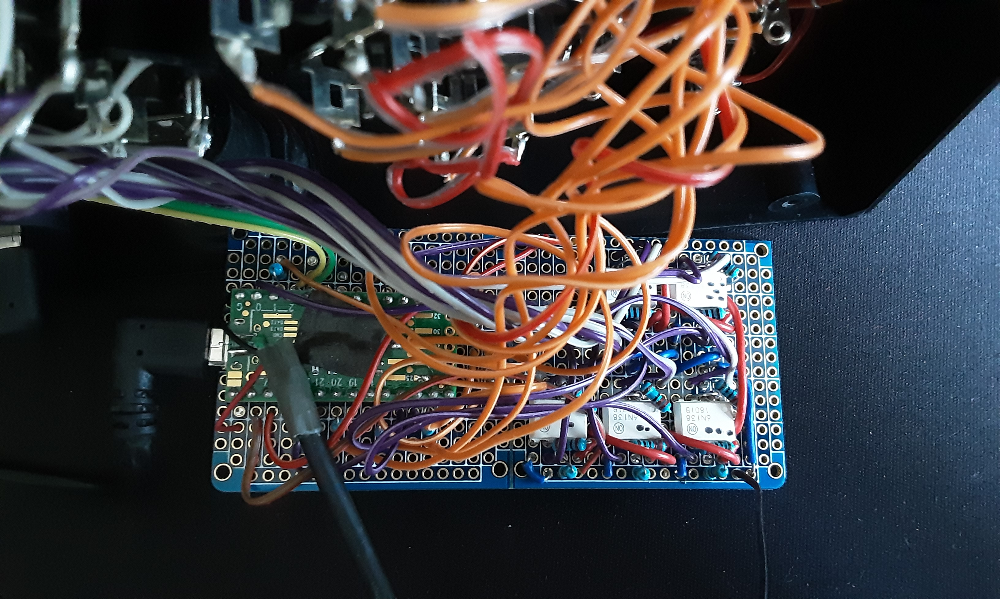
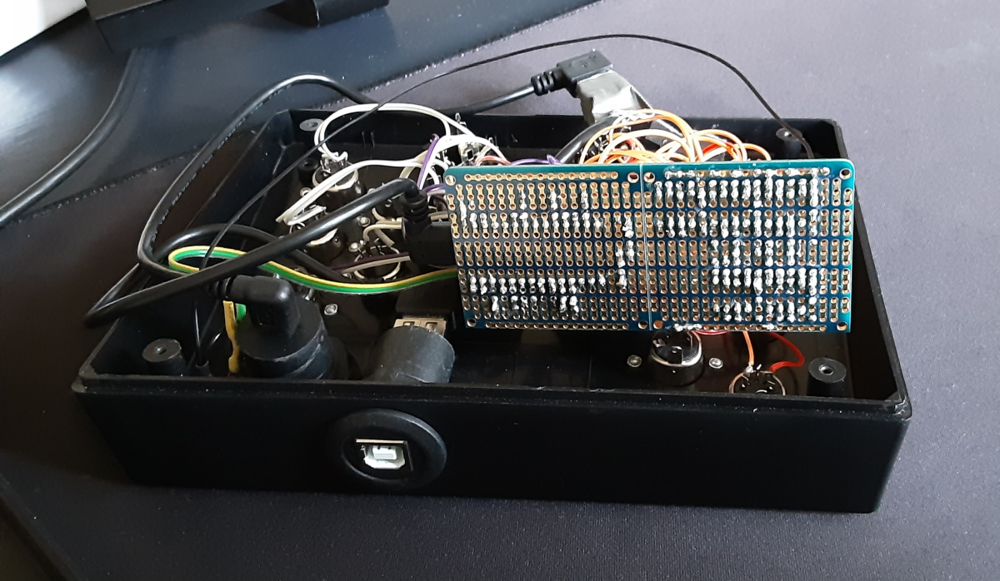
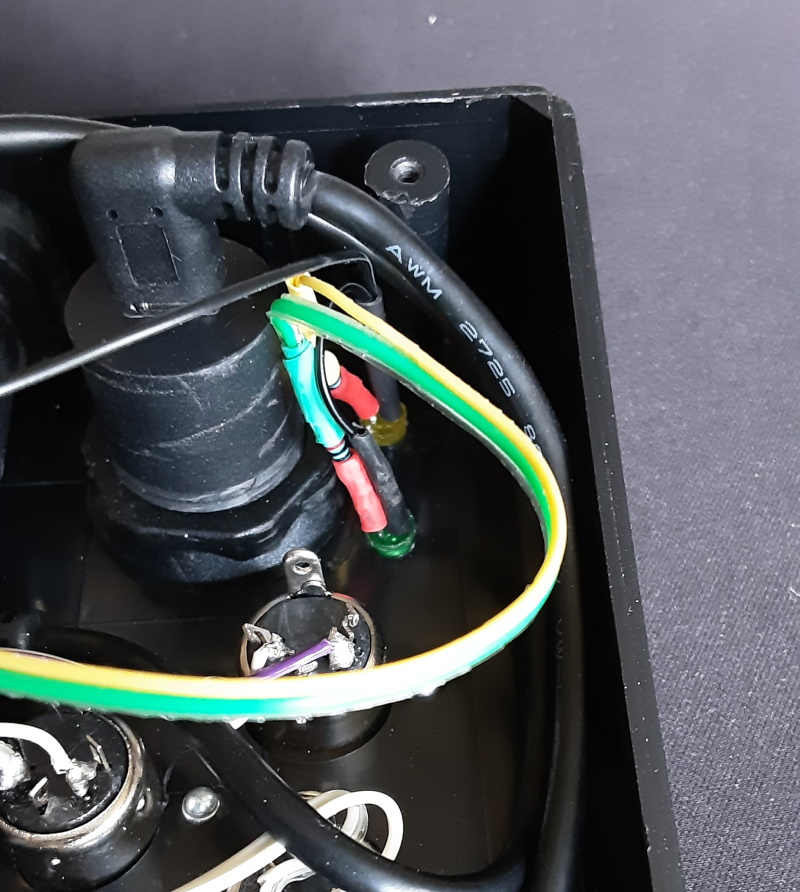

# midiRouter
#### An Open-Source Midi Router

#### This projects aims to make midi easier to deal with, more accessible, and more affordable for musicians. 

https://youtu.be/4NIHAnnQ0Rs

Thank you for stopping in and taking a look at the project! Please let me know if you make a router, it would be really neat to see someone benefitting from this. If anyone would like to collaborate, please feel encouraged. The hardware side of this project is much easier for me than the software, so working with this hodgepodge of midi objects and libraries to get all the ports working has not been the easiest, and I could use some help optimizing it. As far as I can tell it currently duplicates any type of midi message it receives, and then distributes it again properly, except in some USB hosting cases.

It would be really good to see this project turn into a more robust piece of open source DIY music equipment with community support! I've seen the potential for Teensy's powering midi routers, and the sky is the limit.

To program, install [Arduino IDE](https://www.arduino.cc/en/software) and [Teensyduino](https://www.pjrc.com/teensy/teensyduino.html) addon in order to flash Teensy over USB.

###### Hardware To-Do:
- Produce and upload KiCad Schematics and BOM **[*In Progress*]** 
- Add screen, rotary encoder, and two buttons (3 with rotary click) for menu system
- Add expansion bus (SPI?) if hardware speed allows (CV out, etc)
- Design PCB (either rack mount or desktop module) to make sharing the build easier

###### Software To-Do:
- Optimize code (and also get midi objects looping instead of if() stacking)
- Get Korg instruments working over usb (shows up as two midi devices, usb host picks wrong one when connecting minilogue or monologue)
- Add menu system
- Add midi filtration options to menu (clock source/ignore, paired TX/RX DIN ignoring, etc)
- Port to Pi Pico

Currently a prototype has been built and then used on a regular basis without issues, usually just using DIN jacks and wall power or a usb power bank. I normally only have a couple devices hooked up, but I sometimes have 8 or more devices all talking together and working at-speed, and with Ableton continuous automation being sent as well. To prevent having to change clock options on individual instruments and also prevent more than one Midi Clock being broadcast at a time, only one of the DIN ports listens for clock messages (all USB sources listen for clock), the others will discard them. This can easily be changed with an edit over USB with Arduino IDE. 

I use my midiRouter with all of my synthesizers, but I test all of my electrical connections before using them and I keep in mind that musical devices tend to be expensive, and improper wiring or other technical issues associated with home-made hardware can damage them. There is no warranty with this open source system. It may be unwise to risk damaging valuable instruments, especially if they can not be replaced.

For anyone wanting to make their own midi router, an overview of the prototype is below with more to come:

## Prototype Build:

